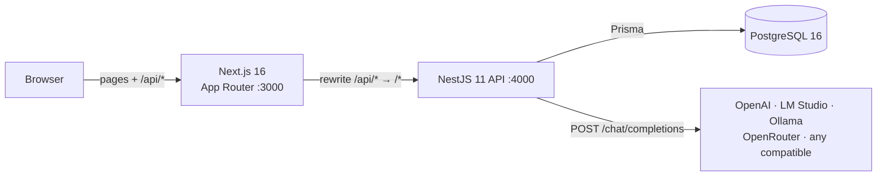
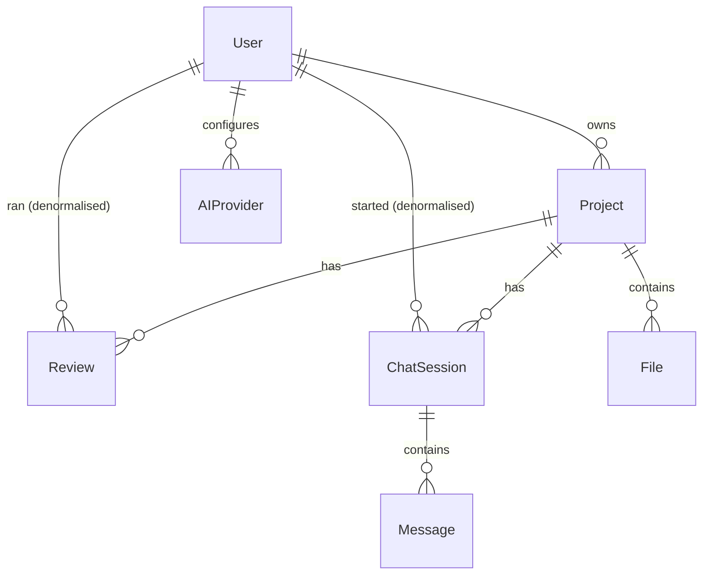
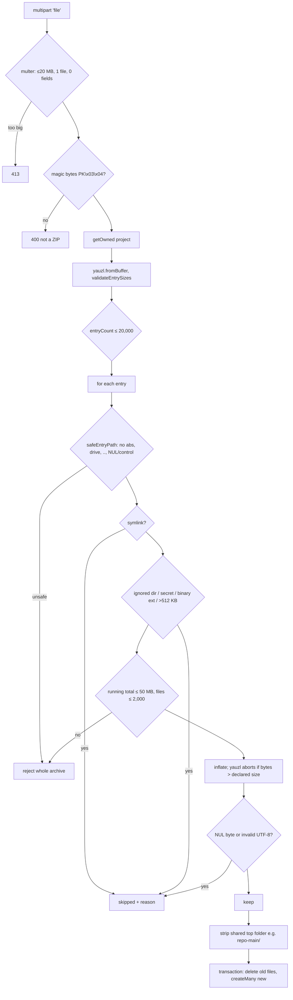

# Architecture

## 1. System overview

A modular monolith: one Next.js frontend, one NestJS API, one PostgreSQL database, plus whichever
OpenAI-compatible model server the user points it at. There are no queues, caches, object storage or
vector databases. The assessment's scale does not need them, and section 11 explains when each would
become worth adding.



**Why the Next.js rewrite proxy.** The browser only ever talks to `localhost:3000`, so the session
cookie is a first-party cookie, `SameSite` behaves as intended and there are no CORS preflights. Next's
rewrite proxy has two defaults that break this app, and both are handled in `frontend/next.config.ts`:

- It times out after 30 s, so `proxyTimeout` is raised above the backend's AI timeout.
- It buffers request bodies and truncates them at 10 MB, which made a 12 MB upload hang. This was
  found by testing. `proxyClientMaxBodySize` is raised, and `src/proxy.ts` rejects anything larger
  with a 413.

## 2. Repository layout

```
backend/src/
  main.ts, app.setup.ts, app.module.ts, config.ts   bootstrap; env validation (zod); global pipes/guards
  auth/          register/login/logout/me, JWT cookie, global JwtAuthGuard
  projects/      CRUD + getOwned(): the single ownership check everything nested uses
  files/         ZIP ingestion (ingest-policy.ts, zip-extractor.ts), file listing, retrieval.service.ts
  providers/     AI provider settings CRUD, AES-256-GCM SecretBox, resolve() → ChatModel
  ai/            chat-model.ts (the provider abstraction), prompts/, schemas.ts (zod),
                 structured-output.ts (validate + retry), context.ts, diff.ts, ai.service.ts
  reviews/       code reviews, diff review, architecture analysis, history
  chat/          sessions + messages
  common/        decorators, user-keyed throttler guard, AI error filter, rate limits
  prisma/        PrismaService
backend/test/    integration suite, fake OpenAI server, ZIP builders
frontend/src/
  proxy.ts       UX route guard + upload size gate
  app/(auth)/    login, register
  app/(app)/     dashboard, projects/new, projects/[id]/{,code,reviews,reviews/[reviewId],chat,diff},
                 settings/providers
  components/    code-viewer, file-tree, review-runner, review-result, upload-zip, ui primitives
  lib/           api client, useApi hook, Shiki setup, tree builder, types
```

There is no `users/` module: nothing reads or writes users except `auth`, so a separate module would
be an empty layer.

## 3. Backend

### Request pipeline

Every request passes through: helmet headers → cookie parser → JSON body parser (1 MB limit) →
**JwtAuthGuard** (global; opt out with `@Public()`) → **UserThrottlerGuard** (global) →
**ValidationPipe** (`whitelist` + `forbidNonWhitelisted` + `transform`) → controller → service →
Prisma. Errors keep Nest's shape `{ statusCode, message, error }`. `AiErrorFilter` maps AI failures to
502/504 in the same shape.

"Secure by default" is the point of the global guard: a new controller is protected unless someone
deliberately writes `@Public()`, and only the register, login and logout routes carry it.

### Authorization (IDOR prevention)

`ProjectsService.getOwned(userId, projectId)` runs `findFirst({ where: { id, userId } })` and throws
404. Every service that touches something inside a project calls it first, or scopes its own query by
`userId` (`reviews`, `chat_sessions`, `ai_providers`) or by `project: { userId }` (single file fetch).
Another user's resource and a non-existent one give the same 404, so IDs cannot be probed. The
integration test "returns 404 for every route touching another user's resources" exercises 14 routes.

## 4. Database



| Table | Notable columns | Constraints / indexes |
|---|---|---|
| `users` | `email` (lower-cased), `passwordHash` (argon2id) | unique `email` |
| `projects` | `name` ≤100, `description` ≤1000 | index `(userId, createdAt desc)` |
| `files` | `path` (normalised, relative), `content` (text), `size`, `extension`, `mimeType` | unique `(projectId, path)`, which also serves lookups by project |
| `reviews` | `type`, `scope`, `filePaths[]`, `summary`, `result` (jsonb), `critical/high/medium/lowCount`, `providerName`, `model`, `searchText` | index `(projectId, createdAt desc)`, `(userId, createdAt desc)` |
| `ai_providers` | `type` (preset label only), `baseUrl`, `encryptedApiKey`, `model`, `isDefault` | unique `(userId, name)` |
| `chat_sessions` | `title` | index `(projectId, createdAt desc)` |
| `messages` | `role`, `content`, `contextFiles[]` | index `(sessionId, createdAt)` |

Design choices:

- **UUID primary keys.** They are unguessable, which is defence in depth on top of the ownership checks.
- **Every foreign key is `ON DELETE CASCADE`**, so deleting a project removes its files, reviews and
  chats in one statement. That matches the UI promise ("permanently deletes the project, its files,
  reviews and chat history").
- **Denormalised `userId` on reviews and chat sessions.** Ownership checks and "all my reviews" never
  need a join through `projects`.
- **Denormalised severity counts and `searchText`.** History pages list and search reviews without
  loading or parsing the `result` JSON. List queries `select` explicit columns and never include
  `result` or file `content`.
- **Reviews keep `filePaths`, `providerName`, `model` and the prompt version** (in `result.meta`), so a
  review stays interpretable after a re-upload or a provider change.
- **Source code is stored in Postgres `text`.** Postgres TOAST compresses and stores out of line any
  value over ~2 kB, and the upload limits cap a project at 50 MB. See
  [docs/research/database-storage.md](docs/research/database-storage.md).

## 5. Authentication flow

```mermaid
sequenceDiagram
  Browser->>Next: POST /api/auth/login {email, password}
  Next->>API: POST /auth/login
  API->>DB: find user by lower-cased email
  API->>API: argon2.verify (dummy hash if user missing: equal timing)
  API-->>Browser: 200 {id,email} + Set-Cookie access_token=JWT; HttpOnly; SameSite=Lax; Max-Age=86400
  Browser->>Next: GET /projects/... (page)
  Next->>Next: proxy.ts: cookie present? else redirect /login (UX only)
  Browser->>API: GET /api/projects (cookie sent automatically)
  API->>API: JwtAuthGuard verifies HS256 signature + expiry → req.user
```

- JWT, HS256, 24-hour expiry, payload `{ sub, email }`. It is stored in an **httpOnly** cookie, so
  script cannot read it and XSS cannot steal the token. It is `Secure` in production.
- **Logout** clears the cookie. Because the JWT is stateless, a copied token stays valid until it
  expires; this is recorded as a known limitation in SECURITY.md. The fix would be a `tokenVersion`
  column checked in the guard, at the cost of one query per request.
- If the backend rejects a cookie (expired, or the secret was rotated), the frontend's API client calls
  logout to clear it before redirecting. Otherwise `proxy.ts` would bounce `/login` straight back to the
  app.

## 6. Upload flow



Nothing is written to disk and nothing is executed. The archive is parsed from memory into rows. The
"resolve against the destination directory" check that prevents Zip Slip is still done, against a
virtual root, so the guarantee does not depend on how the files are used later. See
[docs/research/zip-security.md](docs/research/zip-security.md).

**Re-upload replaces** the project's files. Past reviews keep their own `filePaths` and results, so
they remain readable.

## 7. AI provider abstraction

```
ReviewsService / ChatService
        │  (domain operations)
        ▼
AiService.generateReview · generateDiffReview · generateArchitectureAnalysis · chat
        │  builds prompts, validates output, grounds findings. Knows nothing about vendors.
        ▼
interface ChatModel { complete(messages): Promise<string> }
        │
        ▼
OpenAICompatibleChatModel  →  POST {baseUrl}/chat/completions   (OpenAI, LM Studio, Ollama, OpenRouter, ...)
```

- The brief suggested `AIProvider → OpenAIProvider / OpenAICompatibleProvider`. There is **one**
  implementation because OpenAI *is* an OpenAI-compatible endpoint. A separate `OpenAIProvider` would be
  the same HTTP call with a different default URL. The `type` column (OPENAI, LM_STUDIO, ...) only
  drives UI presets.
- The `ChatModel` interface still earns its place. Tests substitute scripted models for it. A vendor
  with a different protocol, such as Anthropic's native Messages API, would be a second class, and
  nothing above the interface would change.
- `ProvidersService.resolve(userId, providerId?)` picks: the explicit provider → the user's default →
  the env fallback → a 400 with instructions. It decrypts the key only at that moment. The client is a
  thin wrapper over `fetch`, and Node's global undici agent pools connections per origin, so creating
  one per request costs nothing worth caching.
- Requests carry **no `temperature` and no `response_format`**. Newer OpenAI reasoning models reject a
  non-default temperature, and LM Studio's structured output accepts `json_schema` but not
  `json_object`. Structure is enforced by validation instead (section 8), which works identically on
  every server.
- Each request has a timeout (`AbortSignal.timeout`, 180 s default) and redirects are refused. Errors
  are classified (unreachable / timeout / HTTP / malformed) and returned as 502 or 504, with the
  provider's own error message (≤300 chars) so "model not found" is actionable. Keys only ever go into
  the `Authorization` header and are never part of a message or log line.
- `<think>…</think>` blocks from reasoning models (DeepSeek-R1, Qwen3 via Ollama/LM Studio) are
  stripped.

## 8. Review pipeline

```mermaid
sequenceDiagram
  UI->>API: POST /projects/:id/reviews {type, scope, fileIds?, providerId?}
  API->>API: getOwned(project); resolve provider
  alt FILE / FILES
    API->>DB: files where projectId AND id IN fileIds (count must match → else 404)
  else PROJECT
    API->>DB: rank files by review-mode keywords (SQL), pick within budget by stored size
    API->>DB: load contents of picked files only
  end
  API->>API: buildFileContext: line-numbered, random-boundary delimited, 60k-char budget
  API->>Model: system prompt (mode focus + rules + untrusted-input rules + JSON shape) + files
  Model-->>API: text
  API->>API: extract JSON → zod validate
  opt invalid
    API->>Model: same prompt + bad reply + "your JSON did not match: <errors>"
    Model-->>API: text → validate again, or 502 after 2 attempts
  end
  API->>API: ground: drop issues citing unsupplied files; null line > file length
  API->>DB: insert review (+ counts, searchText, meta)
  API-->>UI: review → navigate to detail
```

- **Prompts** live in `backend/src/ai/prompts/`: one file per review mode (a title plus a focus list),
  one per operation (review, diff, architecture, chat), and shared rules. Each operation exports a
  version string that is stored with the result. `review-v2` and `chat-v2` exist because testing
  against a real 7B model showed the v1 prompts letting security findings into performance reviews and
  copying line numbers into chat code blocks.
- **Line numbers** are written into the context (`12| code`), so the model cites lines instead of
  counting them.
- **Evidence control.** The schema requires a `file` per issue; grounding drops findings whose file was
  not supplied and removes out-of-range line numbers. The UI reports how many were dropped. Speculative
  advice goes in `recommendations`, which the UI labels "Suggestions, not confirmed problems".

**Diff review** sends only the hunks (3 lines of context), rendered with new-version line numbers
(`+    12| code`, `-      | removed`). Its output adds `risk` and a per-issue `category`.

**Architecture analysis** sends the whole file tree (up to 12k chars) plus manifests, entry points,
Prisma schema and README (shallowest first, up to 25 files within 30k chars). It never sends the whole
project. Component `path`s that are neither a file nor a directory in the tree are set to `null`.

## 9. Chat retrieval

```
question → extractTerms (lower-case, split camelCase/dots, drop stopwords, crude singulars, ≤12 terms)
        → SQL rank over the project's files:
             score = 3 × (#terms in path) + Σ ln(1 + occurrences of term in content)
        → top 12, then fit by stored size into a 30,000-char budget
        → (no match) fall back to README / package.json / main|index|app|server entry points
        → load contents of chosen files only
        → prompt = rules + untrusted-input rules + last 6 messages (≤2,000 chars each) + files + question
        → answer (code-block line prefixes stripped) + contextFiles stored with the message
```

Scoring runs in Postgres, so file contents never leave the database until the winners are chosen. The
log term stops a file that repeats one word 500 times from beating a file that mentions every term.
User and assistant messages are written in one transaction **after** the model answers, so a failed
request leaves no orphan question. They get explicit timestamps; a bug where both rows shared the
transaction's `now()` and came back in random order was caught by the integration test. Why not
embeddings: see [docs/research/code-context-retrieval.md](docs/research/code-context-retrieval.md).

## 10. Frontend

- **Next.js App Router, all pages client components** fetching `/api/*` through a ~40-line `api()`
  helper and a `useApi()` hook (loading, error and data derived per request key). Server components
  would need the cookie forwarded to the backend on every render. For an authenticated tool with no
  SEO needs, client fetching is simpler, and it is the pattern used throughout.
- **`proxy.ts`** (Next 16's name for middleware) redirects to `/login` when there is no cookie. This is
  UX only; the backend is the authority.
- **Code explorer** URL state: `?file=&line=&review=`. A review finding links there, and the viewer
  highlights the line and renders that review's findings for the file beneath the lines they cite.
  Shiki tokenises per line with a CSS-variables theme, so syntax colours come from the same token file
  as the rest of the UI. Each language grammar is its own lazy chunk. Files over 200k characters render
  as plain text.
- **Design system:** the tokens in `globals.css` (`paper`, `sheet`, `ink`, `rule`, `marker`, four
  severity colours) are the only colours used. The type pairing is Schibsted Grotesk and IBM Plex Mono.
  The concept is a printed listing marked up by a reviewer: the highlighter yellow is used only for
  lines under review and the current selection.
- **Accessibility:** native `<dialog>` for confirmations (focus trap and Escape come free), visible
  `:focus-visible` rings, labelled inputs, `role="tree"` for the file tree, `aria-live` chat log,
  `prefers-reduced-motion` respected, text colours ≥ 4.5:1.

## 11. Tradeoffs and scaling

| Decision | Why it is right here | What changes at scale |
|---|---|---|
| Source in Postgres `text` | One store, transactional replace, SQL retrieval; ≤50 MB per project | Object storage (S3) for blobs, Postgres for metadata; stream extraction to disk |
| Upload parsed in memory (≤20 MB buffer) | No temp files to clean up or escape from | Stream to a scratch volume in a worker; enforce per-user quotas |
| Synchronous AI requests (up to 180 s) | Simple; the UI shows progress; no job infrastructure | A job queue (BullMQ/pg-boss) + status polling or SSE; retries without holding a connection |
| Keyword retrieval with full scans | Correct and explainable at ≤2,000 files | `pg_trgm` GIN index on `content` for `%term%`; then embeddings (pgvector) for semantic questions |
| Stateless JWT, no refresh token | No session table, no lookup per request | `tokenVersion` or a session table for revocation; short access tokens + refresh rotation |
| Throttling in memory | Single process | Redis-backed throttler storage behind a load balancer |
| No streaming responses | Validation needs the whole JSON anyway | Stream chat tokens via SSE; keep reviews buffered |
| One process, one DB | Operable by one person | Split AI work into workers first; the modules are already separated along those lines |

**With 100,000 files**, three things break first. Ingestion hits the 2,000-file and 50 MB limits.
Retrieval's per-question full scan becomes slow. Whole-project reviews cover a smaller fraction of the
code. The next steps, in order: a `pg_trgm` index; chunking files into ~100-line segments with
per-chunk scoring; and, if keyword recall proves insufficient, embeddings stored in `pgvector` beside
the chunks (still Postgres, no new database). For whole-project reviews, a map-reduce over chunks
(review each batch, then summarise) instead of a single prompt.

## 12. Future improvements

1. Background jobs for reviews, with progress and cancellation.
2. Token revocation (`tokenVersion`) and refresh tokens.
3. An egress allowlist for provider base URLs in multi-tenant deployments (SSRF, see SECURITY.md).
4. Provider-native structured output (`json_schema`) when the provider advertises it, keeping
   validation as the backstop.
5. Upload versioning, so diff review can compare two uploads of the same project.
6. Streaming chat answers.
7. Playwright end-to-end tests in CI.
