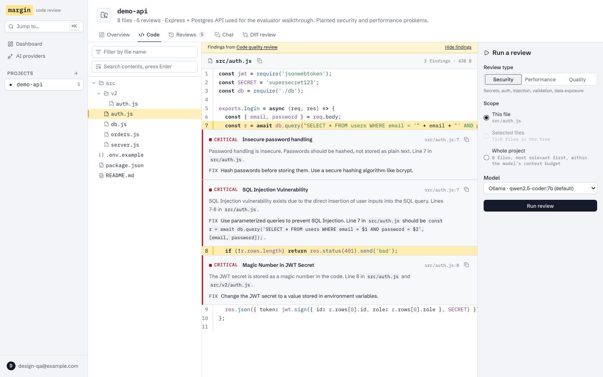
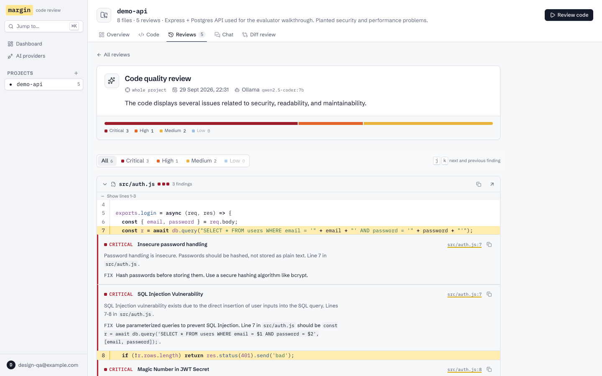
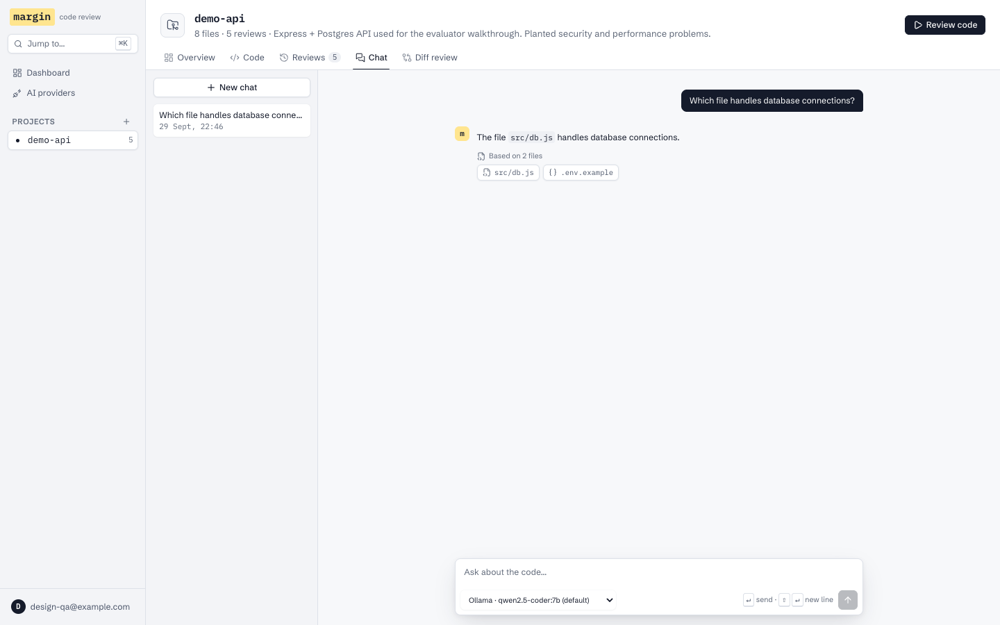
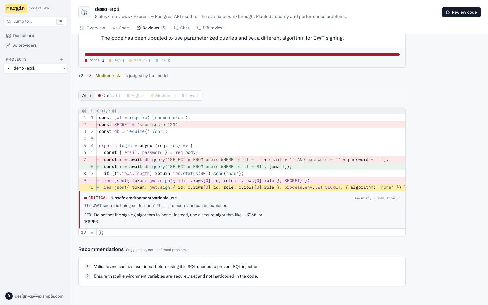
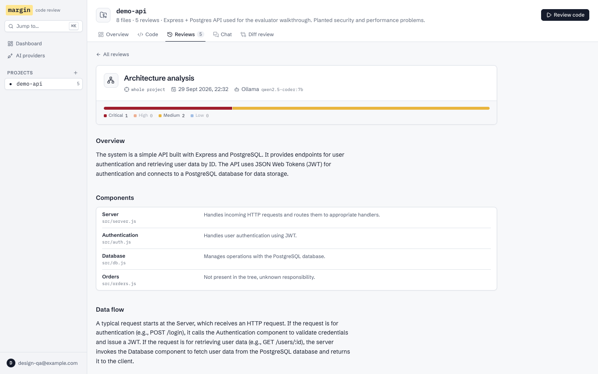

# Margin: AI-Powered Code Review Assistant

Upload a repository as a ZIP, browse it in a lightweight code explorer, run focused AI code reviews
(security, performance, code quality) against any OpenAI-compatible model, read the findings pinned to
the lines they cite, and ask questions about the code.

Built for a 3-day full-stack internship assessment. A deliberately small modular monolith:
**Next.js 16 + NestJS 11 + PostgreSQL 16 (Prisma 6)**, with one OpenAI-compatible AI client that works
with OpenAI, LM Studio, Ollama, OpenRouter and other compatible servers.



## Features

| Area | What it does |
|---|---|
| Authentication | Register, login, logout. Argon2id password hashes, JWT in an `httpOnly` `SameSite=Lax` cookie, a global auth guard, and rate limits on auth routes. |
| Projects | Create, list, open and delete projects. Every query is scoped to the signed-in user. |
| ZIP ingestion | Up to 20 MB. Checked by magic bytes, parsed in memory and never written to disk or executed. Zip Slip and zip bombs are rejected. `node_modules`, `.git`, build output, binaries, symlinks and likely secret files (`.env`, keys, `.npmrc`, ...) are skipped, and the UI reports each skipped file with the reason. |
| Code explorer | File tree, name filter, full-text content search, syntax highlighting (Shiki, grammars loaded on demand), line numbers. Contents are fetched one file at a time. |
| Reviews | Security, performance and code-quality modes over **this file**, **selected files** (up to 50) or the **whole project**, with the scope chosen explicitly. Model output is validated with Zod and retried once with the errors fed back. Findings that cite files the model wasn't shown are discarded. |
| Review UX | Findings grouped by file and pinned under the code they cite (diff reviews redraw the diff), severity filter, `j`/`k` navigation, ⌘K to jump to any project, page or review, a dashboard charting findings per review. Each `file:line` opens the explorer with the line highlighted. The Coverage section lists files that didn't fit the context budget. |
| History | Paginated, searchable (summary, finding titles, file paths) and filterable by type, per project and across projects. |
| Chat | Per-project chat sessions. Keyword retrieval runs in Postgres, only the best-matching files are sent under a character budget, and each answer lists the files it was based on. |
| Diff review (bonus) | Compare a file with another file or with edited text. Only the changed lines, with a little context, are sent to the model. |
| Architecture analysis (bonus) | File tree plus manifests and entry points goes to the model, which returns components, data flow, dependencies, concerns and recommendations. Component paths the model invents are removed. |
| AI providers | Per-user provider settings (base URL, model, API key) with presets, a connection test and a default provider. Keys are AES-256-GCM encrypted and never returned. An optional server-wide fallback provider can be set via environment variables. |

| | |
|---|---|
|  |  |
|  |  |

## Quick start

Requirements: Node.js 20+ (developed on 24), npm 10+, Docker. Exact steps and troubleshooting are in
[SETUP.md](SETUP.md).

```bash
npm install
docker compose up -d postgres                    # Postgres 16 on localhost:5433

cp .env.example backend/.env
# Fill in JWT_SECRET and ENCRYPTION_KEY: run `openssl rand -hex 32` once for each

npm run prisma:deploy -w backend                 # apply migrations
npm run dev:backend                              # API on http://localhost:4000
npm run dev:frontend                             # UI  on http://localhost:3000 (second terminal)
```

Open http://localhost:3000, register, then add an AI provider under **AI providers**. For a free local
model: `brew install ollama && ollama serve && ollama pull qwen2.5-coder:7b`, then pick the **Ollama**
preset. A sample repository with planted issues is at [`docs/demo/demo-api.zip`](docs/demo/demo-api.zip);
[DEMO.md](DEMO.md) walks through every feature with it.

## Environment variables

All backend configuration lives in `backend/.env` and is validated at startup: the process refuses to
start and lists every invalid variable. The frontend needs no env file for local development.

| Variable | Required | Purpose |
|---|---|---|
| `DATABASE_URL` | yes | Postgres connection string. The docker-compose default is in `.env.example`. |
| `JWT_SECRET` | yes | At least 32 characters. Signs session tokens. |
| `ENCRYPTION_KEY` | yes | 64 hex characters (32 bytes). Encrypts stored provider API keys. Changing it makes stored keys unreadable. |
| `PORT` | no | API port (default `4000`). |
| `FRONTEND_URL` | no | Allowed CORS origin (default `http://localhost:3000`). |
| `NODE_ENV` | no | `production` adds the `Secure` flag to the session cookie. |
| `OPENAI_BASE_URL`, `OPENAI_API_KEY`, `OPENAI_MODEL` | no | Optional server-wide fallback provider, used only when a user has configured none. |
| `AI_TIMEOUT_MS` | no | Per-request AI timeout (default 180000). |
| `BACKEND_URL` (frontend) | no | Where Next.js proxies `/api/*` (default `http://localhost:4000`). Read when `next build` runs: rewrites are compiled into the build, so set it before building, not only before `next start`. |

## AI provider setup

Every provider uses the same client (`backend/src/ai/chat-model.ts`), which calls
`POST {baseUrl}/chat/completions`. Presets only pre-fill the form:

| Provider | Base URL | API key |
|---|---|---|
| OpenAI | `https://api.openai.com/v1` | required |
| LM Studio | `http://localhost:1234/v1` | not needed |
| Ollama | `http://localhost:11434/v1` | not needed |
| OpenRouter | `https://openrouter.ai/api/v1` | required |
| Any other compatible server (vLLM, llama.cpp server, ...) | its `/v1` URL | if it requires one |

Local models need a context window of at least 16k tokens: reviews send up to about 60,000 characters of
code. Verified end-to-end with Ollama `qwen2.5-coder:7b`. OpenAI, LM Studio and OpenRouter were not
exercised against their live services (see [AI_USAGE.md](AI_USAGE.md#verification)).

## Testing

```bash
npm test          # backend: Jest unit + integration (needs the Postgres container); frontend: Vitest
npm run lint      # ESLint, zero findings; enforces ≤100-line functions and complexity ≤8 in logic modules
npm run build     # nest build + next build
```

- **Backend (98 tests):** unit tests cover Zip Slip and zip-bomb archives, secret filtering, schema
  validation and retry, grounding, encryption and retrieval. The integration suite runs the real HTTP
  app against a separate test database, with a fake OpenAI-compatible server. It covers registration and
  login, cookie attributes, IDOR checks on every nested route, API-key secrecy, review, chat, diff and
  architecture flows, pagination and search.
- **Frontend (11 tests):** tree building, review-scope resolution, and the code viewer placing findings under the cited line.

## Architecture

```
Browser ──► Next.js (App Router, :3000) ──/api/* rewrite──► NestJS (:4000) ──► PostgreSQL (Prisma)
                                                                   │
                                                                   └──► OpenAI-compatible /chat/completions
```

The browser only talks to the Next.js origin, so the session cookie is first-party. NestJS modules:
`auth`, `projects`, `files` (ingestion + retrieval), `providers`, `ai` (prompts, schemas, validation),
`reviews` and `chat`. See [ARCHITECTURE.md](ARCHITECTURE.md) for request flows, the schema and
tradeoffs.

## Security

Threats and mitigations are in [SECURITY.md](SECURITY.md), including what is **not** mitigated: the
SSRF exposure of user-supplied provider URLs, and the lack of server-side token revocation.

## Documentation

| Document | Contents |
|---|---|
| [SETUP.md](SETUP.md) | Exact installation steps and troubleshooting |
| [DEMO.md](DEMO.md) | 10-minute evaluator walkthrough |
| [ARCHITECTURE.md](ARCHITECTURE.md) | System design, flows, schema, tradeoffs, scaling |
| [API.md](API.md) | Every endpoint, request/response shapes, errors |
| [SECURITY.md](SECURITY.md) | Threat model: threat, attack, mitigation, residual risk |
| [AI_USAGE.md](AI_USAGE.md) | How AI was used to build this, honestly |
| [CONTRIBUTIONS.md](CONTRIBUTIONS.md) | Development process and who decided what |
| [INTERVIEW_PREP.md](INTERVIEW_PREP.md) | Code walkthrough and 45 interview questions |
| [docs/research/](docs/research) | Decision records with sources |
